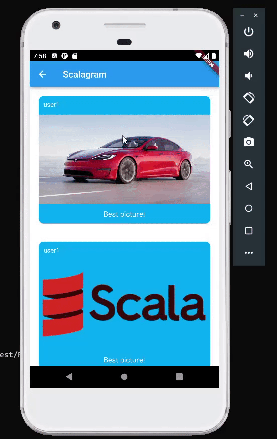

**SCALAGRAM**

*Infra setup*

This project uses docker to run the infra. 

Create the following containers in docker using the commands: 

```` 
docker run -p:5432:5432 --name postgres -e POSTGRES_PASSWORD=postgres -d postgres 
````

```` 
docker run -p 6379:6379 --name redis -d redis
````

```` 
docker run -it -p 6650:6650 -p 8080:8080 --name pulsar --mount source=pulsardata,target=/pulsar/data --mount source=pulsarconf,target=/pulsar/conf apachepulsar/pulsar:2.8.1 bin/pulsar standalone
````

*Configuration*

Before running the app, you must create PostgresSQL tables and Pulsar topics, test the system to create some fake data in the database and finally run the backend. Do it running the main object class as such: 

```` 
sbt "runMain helpers.Setup"
````

and then 

```` 
sbt test
````

and finally 

```` 
sbt run
````

*Running the Flutter App and visualizing user0's feed*

To run the Flutter App you must have Flutter SDK installed in your machine, create an Android virtual device and run the application using Android Studio! The instructions to do that can be found at https://flutter.dev/docs/get-started/install. The Android Studio can be downloaded at https://developer.android.com/studio 
Having all that setup, you can login with user0's credentials to see its feed! :)

The Flutter App project is the directory "scalagramApp" in this folder. Open it with Android Studio and run it. The application will start after some time in the device simulator.

Tip: to visualize the pagination feature you should perform the "push down to refresh" gesture in the app and then scroll up (goes down in the page) to see the older posts like so:

