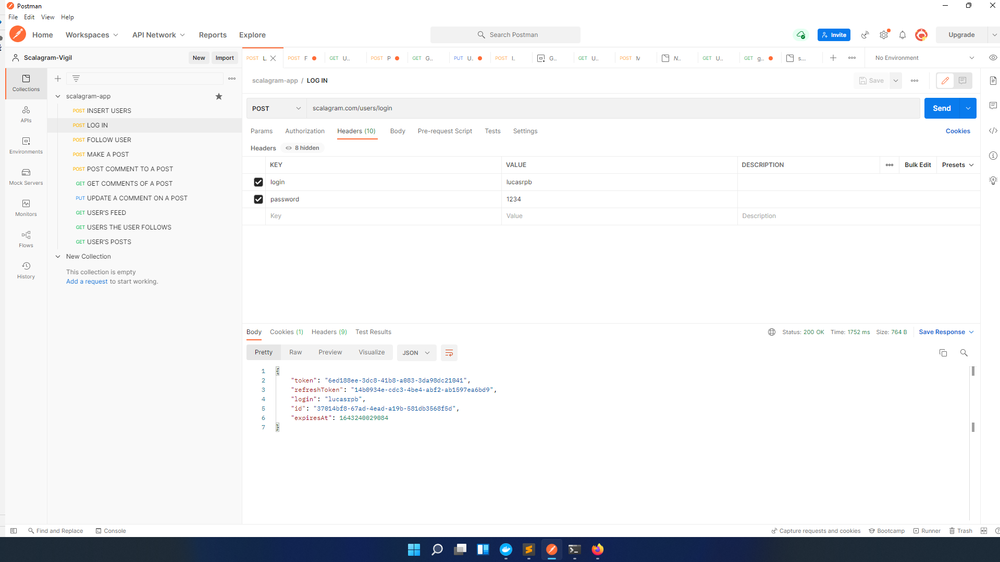

# Deployment

1. cd into scalagram project folder...
2. sbt dist 
3. Copy google_cloud_credentials.json to stage folder in target/universal ...
4. docker build -t lucasrpb/scalagram .
5. docker push lucasrpb/scalagram (my docker hub private registry)

Deployment steps on Digital Ocean ubuntu VM with docker installed: 

1. login into my docker hub account 
2. docker network create local
3. docker pull lucasrpb/scalagram
4. docker run --name postgres -p 5432:5432 --network=local --restart always -e POSTGRES_PASSWORD=***** -d postgres
5. docker run --name scalagram -p 9000:9000 --network=local --restart always -d lucasrpb/scalagram

6. go back to local pc and run: sbt "runMain helpers.CreateTables"
7. back to the digitalocean VM: docker commit postgres (to preserve the tables created)

# Architecture

- The service model used for the application is monolith because of its simplicity. In the future we can separate the modules into microservices and deploy them independently. Although a monolith, we can still scale the application deploying many instances of the same packaged application and load balance between them.
- Database required for the task: postgres. I tried to use Yugabytedb's cloud postgres service but cannot make it work properly in terms of connecting from the digital ocean VM. So I ran a Postgres docker image locally in the same VM. That strategy is, of course not scalable. In the future, once using microservices we can have a single instance of postgres for each microservice. We can also use a distributed database like YugabyteDB or even a NOSQL one!
- Feed scaling approach: this is a hard task when it comes to distributed systems. I implemented what is called fan out on write approach. What I did was to use a message system called Apache Pulsar. I created a partitioned topic for the feed. A scalable subscriber service named FeedJobHandler.scala receives the post event and gets from the database a batch of the users following the post's author. While there is still users it will create another task for the next batch. Each task containing the post id and the batch of subcribers is executed and it consists of insertions in the feed's table contaning the postId, authorId and followerId. To see the posts from people the user follows, the application reads that feed view, querying by the followerId.   
- Image processing scaling approach: for scaling the image processing part, I also used a Apache Pulsar partitioned topic. Image processing tasks are published on some partition of that topic. Workers then pick up those tasks and execute the scaling down of images, which are then stored in a Google Cloud Storage bucket. After finish the task each worker publishes a message to the API service instance Pulsar topic (non persistent) sinalizing that the work its done and the image is ready. 
- How to execute API commands: use a tool like postman! :) All the API calls are exported in the file called scalagram-app.postman_collection.json! It can be imported into Postman's. Here is how to do it: File > Import on the app.

